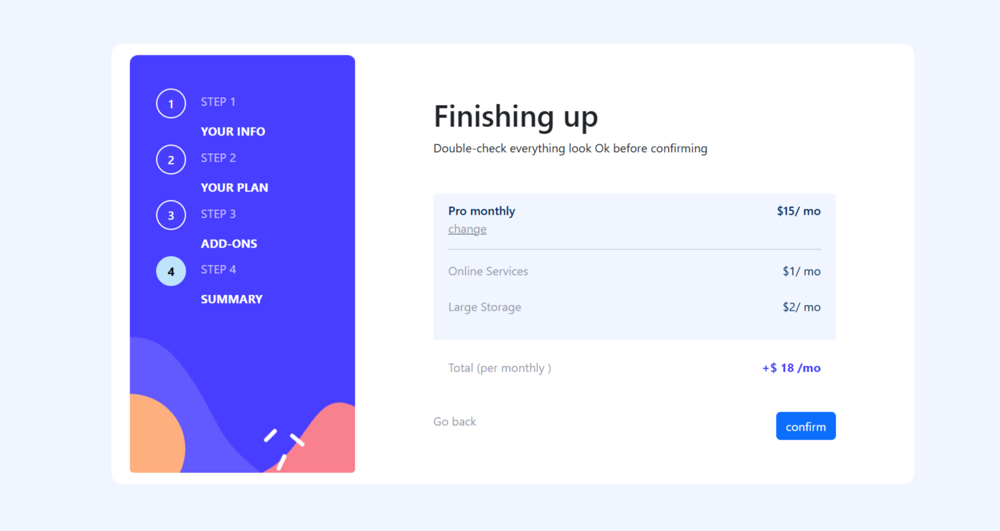

# Frontend Mentor - Multi-step form solution

This is a solution to the [Multi-step form challenge on Frontend Mentor](https://www.frontendmentor.io/challenges/multistep-form-YVAnSdqQBJ). Frontend Mentor challenges help you improve your coding skills by building realistic projects. 

## Table of contents

- [Overview](#overview)
  - [The challenge](#the-challenge)
  - [Screenshot](#screenshot)
  - [Links](#links)
- [My process](#my-process)
  - [Built with](#built-with)
  - [What I learned](#what-i-learned)
  - [Continued development](#continued-development)
  - [Useful resources](#useful-resources)
- [Author](#author)

**Note: Delete this note and update the table of contents based on what sections you keep.**

## Overview

### The challenge

Users should be able to:

- Complete each step of the sequence
- Go back to a previous step to update their selections
- See a summary of their selections on the final step and confirm their order
- View the optimal layout for the interface depending on their device's screen size
- See hover and focus states for all interactive elements on the page
- Receive form validation messages if:
  - A field has been missed
  - The email address is not formatted correctly
  - A step is submitted, but no selection has been made

### Screenshot

These are the screenshot of different different task of the project 

### Links

- Solution URL: [Add solution URL here](https://your-solution-url.com)
- Live Site URL: [Add live site URL here](https://your-live-site-url.com)

## My process

### Built with

- Semantic HTML5 markup
- CSS custom properties
- Flexbox
- CSS Grid
- Bootstrap
- Mobile-first workflow
- [React](https://reactjs.org/) - JS library
- React Context Api 
- React useReducer Hook

**Note: These are just examples. Delete this note and replace the list above with your own choices**

### What I learned

I learned a lot of new thing and i will that this project teach me alots of new things like how to manage the data of all the forms and display and render that data in a specific place . I use the useReducer hook and i understand that how it actually work and many new think like use of context api which work like a store . In short i practice my React skill for efficently  and learn a things ..  

### Continued development
 
i am working on the other projects some  of React and and are without React and Everyday learning new thing  and developing something new each day.

### Useful resources

- [Bootstrap](https://getbootstrap.com/) - This helped me for making a html form and there a lot of pre design formed are available you can go and check it out  . I really liked this pattern and will use it going forward.

## Author

- Frontend Mentor - [@Benyameen-cs](https://www.frontendmentor.io/profile/Benyameen-cs)

